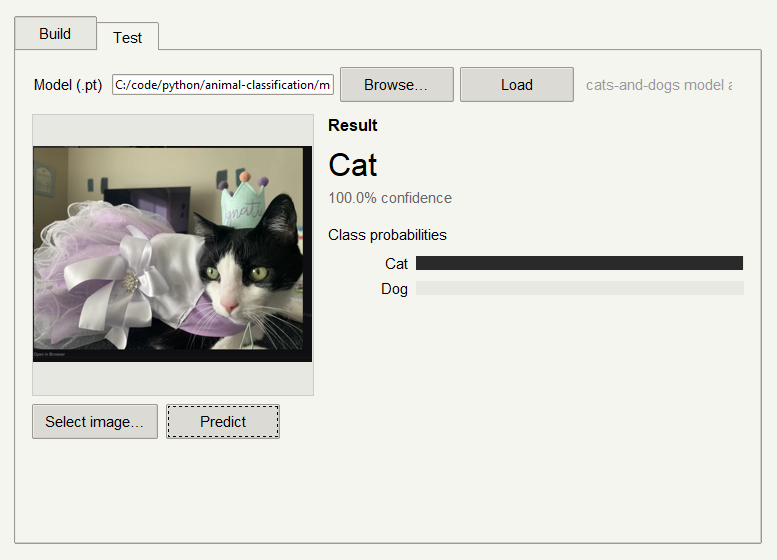
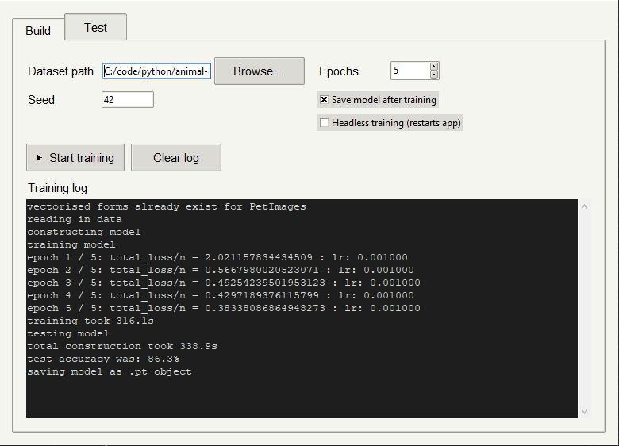
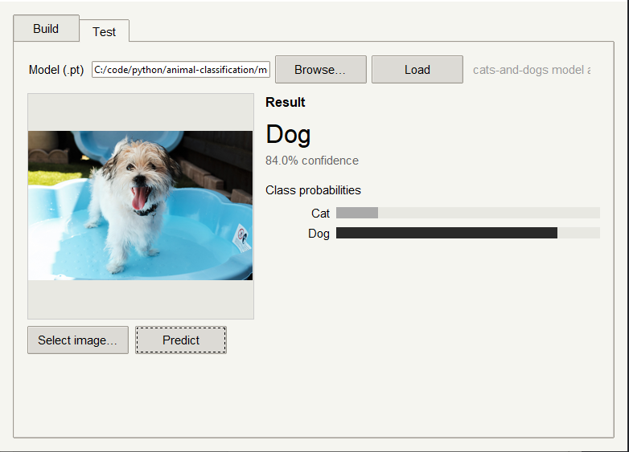

# Computer Vision Image Classification

A simple generalised Image Classification Pipeline capable of training, testing, and scaling image recognition models.

> **It is currently possible to:**
>
> - Test pre-saved models on a CPU, training using large image datasets on CPU may result in extremely long compute times
>
> - Train and test models on a CUDA GPU
>    
>



## Build instructions

### 1. Python virtual environment

To create a python virtual environment run the following commands in the root of the project directory.

```bash
python -m venv venv
```

followed by activating the environment:

```bash
source ./venv/bin/activate  #Linux/MacOS
.\venv\Scripts\activate     #Windows
```

### 2. Installing Dependencies

While the virtual environment is active, run one of the following commands.

```bash
pip install -r requirements.txt     #CPU install
pip install -r requirements-gpu.txt #GPU install
```

Even though the required GPU builds are completely CPU compatible for testing, much more storage is required for GPU backends that will not be utilised.

### 3. Executing the program

The main script can be executed as the full application or in a headless state to allocate more resources during model training.

There is a limitation for headless execution when launching from the full application on Windows. Due to the job nature of processes within Windows, there is a chance of creating an orphaned process. Although it doesn't take up too many resources, the process should be killed via terminal or Task Manager

To start the GUI application run the following command.

```bash
python src/main.py
```

To launch headless model construction run the main script with the following commands.

```bash
python src/main.py --headless <dataset> <epochs> <seed>
```

#### Parameters

- `<dataset>` - Path to dataset or dataset name if the dataset lives within the `data` directory

- `<epochs>` - Integer number of training iterations

- `<seed>` - Integer seed of random number generation operations

For headless execution the `<dataset>` parameter is required, if `<epochs>` and `<seed>` are ignored they assume default values. (20 epochs and a random 32-bit integer respectively).

Headless training will always save a JIT TorchScript model file, [`models/dataset_name.pt`](models).

## Generalised model construction

Construction of model parameters is modular to the number of classes present within any image dataset of the form below.

```
Dataset
├─── Class 1<dir>
├─── Class 2<dir>
...
```

> **Note:**
>
> - For binary classification tasks (e.g. defective/non-defective in manufacturing),
>   consider replacing the final classification head with a BCE (Binary Cross-Entropy) loss
> - Generally CCE (Categorical Cross-Entropy) is preferred for 2+ class output heads, it is slightly bottle-necked for binary classification

### Training models

#### Hardware disclaimer

When training models it is highly recommended to use adequate hardware like a TPU/GPU for computation. This project has only implemented CUDA GPU compatibility so far

It is also strongly recommended to use sufficient SSD storage as the processed image datasets become rather large, struggling to fully fit into memory all at once.

#### Building a model

In the `Build` tab, simply select the root of the image dataset you wish to use. The raw data will then be processed if vectorised forms do not already exist. Once processed the model will be trained and evaluated using splits of the whole dataset

After adjusting training parameters, tick any extra criterion. When training headless, the application will temporarily shutdown and automatically open again when training and evaluation are complete; models are always saved as JIT TorchScript files.



After training, the model will be stored within the [`classifier_ui::App.current_model`](src/classifier_ui.py) field and can be tested without having to be saved or read in.

### Demonstration

#### Example Model

A simple example model capable of classifying cats and dogs can be found in [`models/cats-and-dogs.pt`](models). The model was trained using [this dog and cat classification dataset](https://www.kaggle.com/datasets/bhavikjikadara/dog-and-cat-classification-dataset) from Kaggle.

#### Playing around with pre-saved models

Browse for the model you wish to load in via the `Test` tab, select an image to observe the model's classification prediction.



Some example test images are located in [`data/test-images`](data/test-images/)

> **Benchmark Reference: `cats-and-dogs.pt`**
>
> - **Hardware:** NVIDIA RTX 2060 (6GB VRAM) / AMD Ryzen 5 3600, Western Digital Blue M.2 SSD
> - **Dataset Size:** 24997 images ($224 \times 224 \times 3$), 14.02GB
> - **Training Time:** 28 minutes (25 epochs)
> - **Optimization:** Step Learning Rate decay, AMP `float16` precision autocast. `memmap` dataset stream and sorted indices for faster storage localisation
> - 95.6% accuracy utilizing Categorical Cross-Entropy loss
